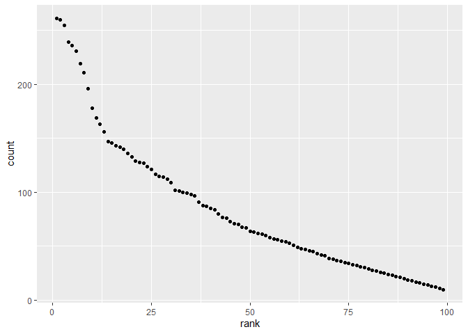

p8105\_hw2\_dw2903
================
Di Wu
October 04, 2019

# Question 1

### read and clean Mr. Trash Whell sheet

``` r
MrWheel = 
  readxl::read_excel("./hw2_data/Trash-Wheel-Collection-Totals-8-6-19.xlsx", range= "A2:N408") %>%
  janitor::clean_names() %>%
  mutate(
    sports_balls = as.integer(sports_balls)) %>%
  drop_na(dumpster) %>%
  pivot_longer(
    plastic_bottles:homes_powered,
    names_to = "category",
    values_to = "numbers"
  ) 
```

### Read and clean 2017 precipitation

``` r
precipitation_17 = 
  readxl::read_excel("./hw2_data/Trash-Wheel-Collection-Totals-8-6-19.xlsx", sheet = 6, range = "A2:B14") %>%
  janitor::clean_names() %>%
  drop_na(month) %>%
  mutate(
    year = 2017
  ) %>%
  select(year, month, precipitation = total)
```

### Read and clean 2018 precipitation

``` r
precipitation_18 = 
  readxl::read_excel("./hw2_data/Trash-Wheel-Collection-Totals-8-6-19.xlsx", sheet = 5, range = "A2:B14") %>%
  janitor::clean_names() %>%
  drop_na(month) %>%
  mutate(
    year = 2018
  ) %>%
  select(year, month, precipitation = total) 
```

### combine precipitation

``` r
precipitation = full_join(
  precipitation_17, precipitation_18)%>%
  mutate(
    month = as.factor(as.integer(month)),
    month = factor(month.name[month],levels = month.name[1:12]) 
  )
```

    ## Joining, by = c("year", "month", "precipitation")

Mr. Trash Wheel represent the trash disposal through 2014.May to 2019.
June. It not only indicated the weight and volume of the trash but also
showed the amounts of different categories of trash as key variables in
the table. Turning to the precipitation from 2017 to 2018, the key
variables are the dates as well as the precipitation amount that showed
the change of precipitation through time more visually. The total
precipitation in 2018 was 70.33 inches and the mean precipitation in
2017 is 2.145 inches as calculated from the data in the table.

# Question 2

### pols\_month

``` r
pols= 
  read.csv("./hw2_data/pols-month.csv") %>%
  janitor::clean_names() %>%
  separate(col=mon, into= c("year","month","day")) %>%
  mutate(
    year = as.integer(year),
    day = as.integer(day),
    month = as.factor(as.integer(month)),
    month = factor(month.name[month],levels = month.name[1:12]) 
  ) %>% 
  pivot_longer(
    cols = prez_gop:rep_dem,
    names_to = "president",
    values_to = "number"
  ) %>%
  filter(president !="prez_dem")%>%
  filter(president !="prez_gop")%>%
  select(-day)
```

### snp

``` r
snp = 
  read.csv("./hw2_data/snp.csv") %>%
  janitor::clean_names()%>%
  separate(col=date, into=c("month","day","year")) %>%
  mutate(
    year = as.integer(year),
    day = as.integer(day),
    month = as.integer(month),
    month = as.factor(month),
    month = factor(month.name[month],levels = month.name[1:12]) 
  ) %>%
  select(year, month, snp= close)
```

### unemployment

``` r
unemployment = 
  read.csv("./hw2_data/unemployment.csv") %>%
  pivot_longer(
    cols = Jan:Dec,
    names_to = "month",
    values_to = "unemployment"
  )%>%
  select(
    year = Year,everything()
  )
```

### combination

``` r
combination = 
  left_join(pols,snp, by= c("year", "month")) %>%
  left_join(unemployment, by=c("year","month"))
```

    ## Warning: Column `month` joining factor and character vector, coercing into
    ## character vector

The pols data set consists of numbers of republican and democratic
governors, senators, representatives as well as the president condition
from January 15th, 1947 to June 15th, 2015. The processed data only
contained the numbers of government officers in different position in
republican and democratic with their corresponding years and months. Snp
data represent the S\&P stock market index through January 3rd, 1950 to
July 1st, 2015. After cleaning, the dataset contains only month and year
as well as the stock price. Unemployment data includes the each months’
unemployment rates through 1948 to 2015 and the dataset was arranged in
the order of year, month and unemployment rates after cleaning.

# Question 3

### clean data

``` r
name = 
  read.csv('./hw2_data/Popular_Baby_Names.csv') %>%
  janitor::clean_names() %>%
  mutate(
    child_s_first_name = str_to_lower(child_s_first_name),
    year_of_birth = as.integer(year_of_birth),
    gender =as.factor(str_to_lower(gender)),
    ethnicity = as.factor( str_to_lower(ethnicity)),
    ethnicity = recode(ethnicity, "asian and paci"="asian and pacific islander", 
                       "black non hisp" = "black non hispanic",
                       "white non hisp" = "white non hispanic"),
    count = as.integer(count),
    rank = as.integer(rank)
  )%>%
  distinct()
```

factor(month.name\[month\],levels = month.name\[1:12\]) \#\#\# rank of
olivia in female

``` r
Olivia_rank =
  filter(name, child_s_first_name == "olivia",
         gender == "female"
         )%>%
  select(year_of_birth, ethnicity, rank)%>%
  pivot_wider(
    names_from = "ethnicity",
    values_from = "rank"
  ) 
```

### most popular name among male

``` r
male_rank = 
  filter(name, gender == "male") %>%
  select(child_s_first_name, year_of_birth, ethnicity, rank) %>%
  pivot_wider(
    names_from = "ethnicity",
    values_from = "rank"
  ) %>%
  janitor::clean_names() %>%
  mutate(
    rank_total = asian_and_pacific_islander+ black_non_hispanic+ hispanic+ white_non_hispanic
  ) %>%
  arrange(rank_total) %>%
  filter(
    child_s_first_name == child_s_first_name[1]
  ) %>%
  select( -rank_total) 
```

### 2016, white non-hispanic children male

``` r
male_16_wnh = 
  filter(name, gender == "male", ethnicity == "white non hispanic", year_of_birth == 2016) %>%
  select(child_s_first_name, ethnicity, count, rank)
ggplot(male_16_wnh, aes(y=count, x=rank))+geom_point()
```

<!-- -->
